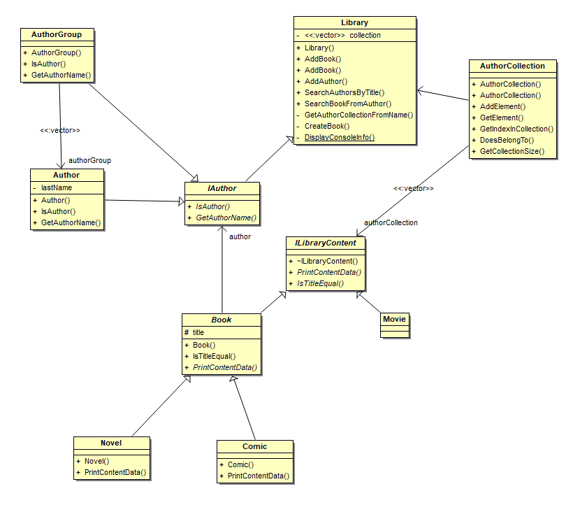

# test_kbehra

# Objectives 

Develop a console application in C ++ allowing the management of a library containing books, comics
and their authors.

In input, it will be possible to : 

* Add a book 
* Add an author 
* to find the author 
* to search the books of a given author 

# Requirements 

* CMake 

Project developed and validated on GCC v9.3.0.

Project validated on MSVC 19.29.30040.0

# Build and run 

go the project directory 

`$ cd ../../test_kbehra `

build the solution 

`$ cmake CMakeLists.txt `

`$ make`

run 

`$ ./TEST_KBEHRA`

# Console commands 

* Exit the application 

  `$ 0`

* Add a book to the library 

  `$ 1 "@yourTitle" "@authorName" x` 

​		Examples :

​			`$ 1 "La nuit des temps" "Barjavel" 0` will add this content as a "Novel"

​			`$ 1 "Astérix le Gaulois" "Goscinny" 1` will add this content as a "Comic" 

* Add an author to the library 

  `$ 2 "@authorName"`

  the author will be add to the library if he is not already in. 

  Examples : 

   	`$ 2 "Dupont"`

* Search for an author according to a content name 

  `$ 3 "@title"`

  Return the author's name. If several works have the same name, 

  all the authors are returned. 

  Example : 

   	`$ 3 "La nuit des temps"` 

 * Search all works by an author name 

   `$ 4 "@nameOfTheAuthor"`

   Return all the content of an author 

   ​	`	$ 4 "Barjavel"`

* Add some samples to the library 

  `$ 5`

* Display the help message 

  `$ 6`

# Details 

The Library is organized by AuthorCollection. Each IAuthor of the Library have his collection. An IAuthor can have a empty collection, but he can't have two contents with a same title in his collection. 

Each element of an AuthorCollection is an ILibraryContent. This interface describes how a content of the library should works. 

The implemented content (Book) is a particular type of a Content. This Book can be declined in Comic or Novel. 

IAuthor is an interface. It can be describe an Author, or an AuthorGroup. 

